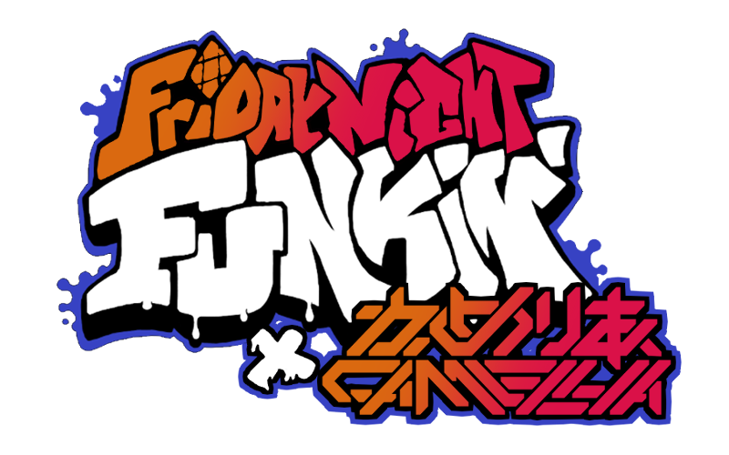
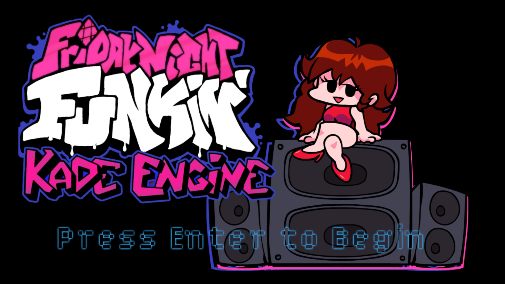
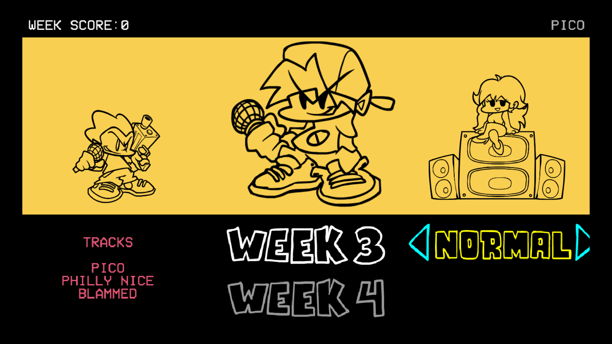
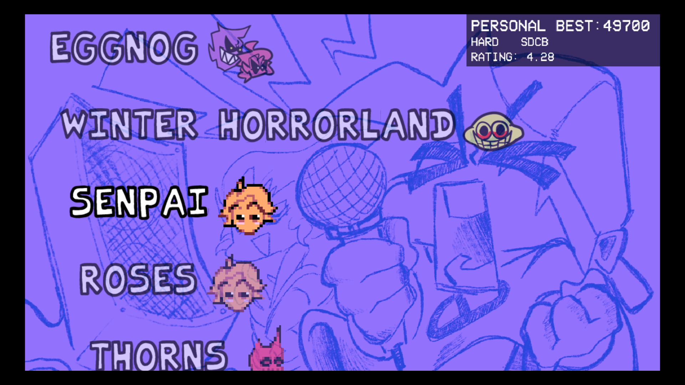

<<<<<<< HEAD
# The repository for the Vs Cameilla mod

## Compiling yourself:

You need to have the tools to compile like any other version of Kade Engine.

**Please note**: To build for *Windows*, you need to be on *Windows*. To build for *Linux*, you need to be on *Linux*. Same goes for macOS. You can build for html5/browsers on any platform.

## Dependencies
 1. [Install Haxe 4.1.5](https://haxe.org/download/version/4.1.5/). You should use 4.1.5 instead of the latest version because the latest version has some problems with Friday Night Funkin': Kade Engine.
 2. After installing Haxe, [Install HaxeFlixel](https://haxeflixel.com/documentation/install-haxeflixel/).
 3. Install `git`.
	 - Windows: install from the [git-scm](https://git-scm.com/downloads) website.
	 - Linux: install the `git` package: `sudo apt install git` (ubuntu), `sudo pacman -S git` (arch), etc... (you probably already have it)
 4. Install and set up the necessary libraries:
	 - `haxelib install lime 7.9.0`
	 - `haxelib install openfl`
	 - `haxelib install flixel`
	 - `haxelib run lime setup`
	 - `haxelib run lime setup flixel`
	 - `haxelib install flixel-tools`
	 - `haxelib run flixel-tools setup`
	 - `haxelib install flixel-addons`
	 - `haxelib install flixel-ui`
	 - `haxelib install hscript`
	 - `haxelib install newgrounds`
	 - `haxelib install linc_luajit`
	 - `haxelib install actuate`
	 - `haxelib git extension-webm https://github.com/KadeDev/extension-webm`
	 - `haxelib git faxe https://github.com/uhrobots/faxe`
	 - `haxelib git polymod https://github.com/larsiusprime/polymod.git`
	 - `haxelib git discord_rpc https://github.com/Aidan63/linc_discord-rpc`
	 - `lime rebuild extension-webm [windoes/mac/linux]` *dependent on which machine you are compiling on*

### Windows-only dependencies (only for building *to* Windows. Building html5 on Windows does not require this)
If you are planning to build for Windows, you also need to install **Visual Studio 2019**. While installing it, *don't click on any of the options to install workloads*. Instead, go to the **individual components** tab and choose the following:

-   MSVC v142 - VS 2019 C++ x64/x86 build tools
-   Windows SDK (10.0.17763.0)
-   C++ Profiling tools
-   C++ CMake tools for windows
-   C++ ATL for v142 build tools (x86 & x64)
-   C++ MFC for v142 build tools (x86 & x64)
-   C++/CLI support for v142 build tools (14.21)
-   C++ Modules for v142 build tools (x64/x86)
-   Clang Compiler for Windows
-   Windows 10 SDK (10.0.17134.0)
-   Windows 10 SDK (10.0.16299.0)
-   MSVC v141 - VS 2017 C++ x64/x86 build tools
-   MSVC v140 - VS 2015 C++ build tools (v14.00)

This will install about 22 GB of crap, but is necessary to build for Windows.

### macOS-only dependencies (these are required for building on macOS at all, including html5.)
If you are running macOS, you'll need to install Xcode. You can download it from the macOS App Store or from the [Xcode website](https://developer.apple.com/xcode/).

If you get an error telling you that you need a newer macOS version, you need to download an older version of Xcode from the [More Software Downloads](https://developer.apple.com/download/more/) section of the Apple Developer website. (You can check which version of Xcode you need for your macOS version on [Wikipedia's comparison table (in the `min macOS to run` column)](https://en.wikipedia.org/wiki/Xcode#Version_comparison_table).)

## Cloning the repository
Since you already installed `git` in a previous step, we'll use it to clone the repository.
1. `cd` to where you want to store the source code (i.e. `C:\Users\username\Desktop` or `~/Desktop`)
2. `git clone https://github.com/KadeDev/Kade-Engine.git`
3. `cd` into the source code: `cd Kade-Engine`
4. (optional) If you want to build a specific version of Kade Engine, you can use `git checkout` to switch to it (i.e. `git checkout 1.4-KE`) (remember that versions 1.4 and older cannot build to Linux or HTML5)
- You should **not** do this if you are planning to contribute, as you should always be developing on the latest version.

## Building
Finally, we are ready to build.

- Run `lime build <target>`, replacing `<target>` with the platform you want to build to (`windows`, `mac`, `linux`, `html5`) (i.e. `lime build windows`)
- The build will be in `Kade-Engine/export/<target>/bin`, with `<target>` being the target you built to in the previous step. (i.e. `Kade-Engine/export/windows/bin`)
- Only the `bin` folder is necessary to run the game. The other ones in `export/<target>` are not.

=======

         

       

# Friday Night Funkin': Kade Engine
## Friday Night Funkin'
**Friday Night Funkin'** is a rhythm game originally made for Ludum Dare 47 "Stuck In a Loop".

Links: **[itch.io page](https://ninja-muffin24.itch.io/funkin) ⋅ [Newgrounds](https://www.newgrounds.com/portal/view/770371) ⋅ [source code on GitHub](https://github.com/ninjamuffin99/Funkin)**
> Uh oh! Your tryin to kiss ur hot girlfriend, but her MEAN and EVIL dad is trying to KILL you! He's an ex-rockstar, the only way to get to his heart? The power of music... 

## Kade Engine
**Kade Engine** is a mod for Friday Night Funkin', including a full engine rework, replays, and more.

Links: **[GameBanana mod page](https://gamebanana.com/gamefiles/16761) ⋅ [play in browser](https://funkin.puyo.xyz) ⋅ [latest stable release](https://github.com/KadeDev/Kade-Engine/releases/latest) ⋅ [latest development build (windows)](https://ci.appveyor.com/project/KadeDev/kade-engine-windows/branch/master/artifacts) ⋅ [latest development build (macOS)](https://ci.appveyor.com/project/KadeDev/kade-engine-macos/branch/master/artifacts) ⋅ [latest development build (linux)](https://ci.appveyor.com/project/KadeDev/kade-engine-linux/branch/master/artifacts)**

**REMEMBER**: This is a **mod**. This is not the vanilla game and should be treated as a **modification**. This is not and probably will never be official, so don't get confused.

## Website ([KadeDev.github.io/kade-engine/](https://KadeDev.github.io/Kade-Engine/))
If you're looking for documentation, changelogs, or guides, you can find those on the Kade Engine website.

# Previews ([skip](#features))

# Features

 - **New Input System**
	 - An improved input system, similar to Quaver or Etterna, with less delays, less dropped inputs and other improvements.
 - **More information during gameplay**
	 - While you're playing, we show you information about how you're doing, such as your accuracy, combo break count, notes per second, and your grade/rating.
 - **Customizable keybinds**
	 - Instead of being forced to use WASD and the arrow keys, you can set any keybinds you want!
 - **Replays** (in beta)
	 - Have you ever gotten a crazy score but didn't record? The replay system solves that: it automatically saves a "replay" of your gameplay every time you complete a song, which you can play back inside of the game. 
	 - Replays just store information about what you're doing, they don't actually record the screen -- so they take up way less space on your disk than videos.
 - **Audio offset**
	 - If your speakers or headphones are delayed, you can set an offset in the options menu to line the game up with the delay and play with synced audio like intended!
 - **And much, much more!**
	 - There's so much more in store than just what's listed here! If you can imagine a quality of life feature, it's probably
	 either already included in Kade Engine or is being worked on!

# Credits
### Friday Night Funkin'
 - [ninjamuffin99](https://twitter.com/ninja_muffin99) - Programming
 - [PhantomArcade3K](https://twitter.com/phantomarcade3k) and [Evilsk8r](https://twitter.com/evilsk8r) - Art
 - [Kawai Sprite](https://twitter.com/kawaisprite) - Music

This game was made with love to Newgrounds and its community. Extra love to Tom Fulp.
### Kade Engine
- [KadeDeveloper](https://twitter.com/KadeDeveloper) - Maintainer and lead programmer
- [The contributors](https://github.com/KadeDev/Kade-Engine/graphs/contributors)

### Shoutouts
- [GWebDev](https://github.com/GrowtopiaFli) - Video Code
- [Rozebud](https://github.com/ThatRozebudDude) - Ideas (that I stole)
- [Puyo](https://github.com/daniel11420) - Setting up appveyor and a lot of other help
- [Smokey](https://twitter.com/Smokey_5_) - telling me that I should do the tricky asset loading
>>>>>>> project2/master
